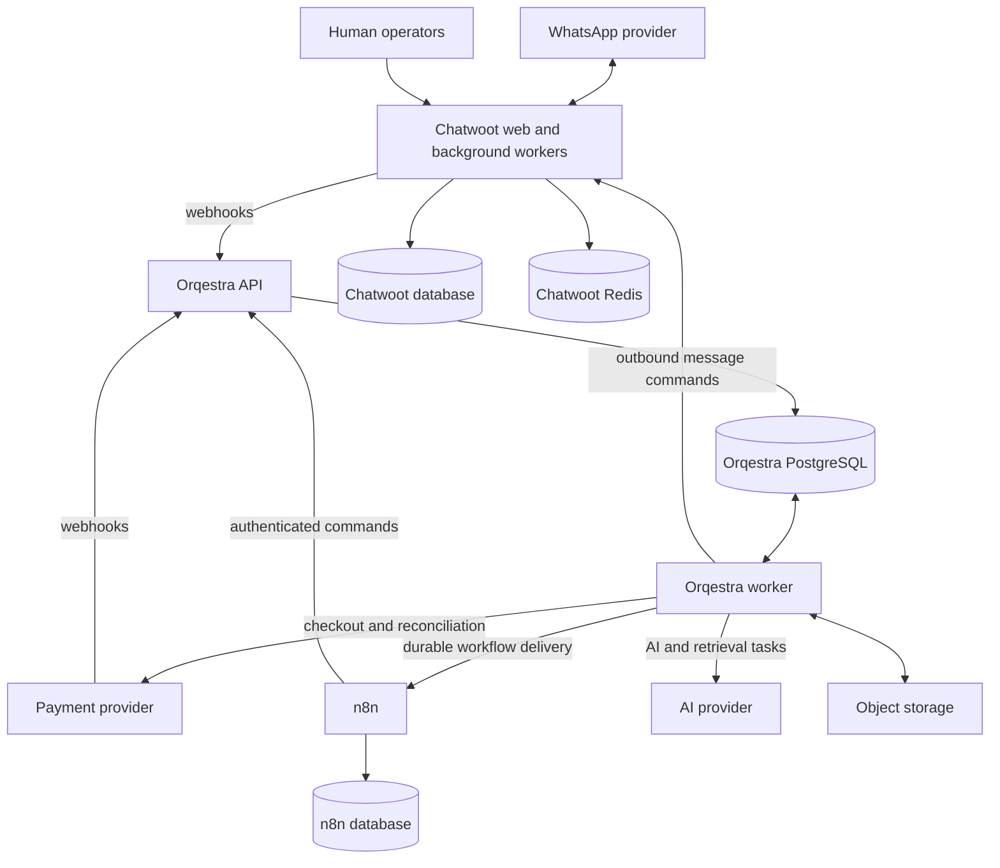

# Orqestra architecture

Status: proposed foundation, 2026-09-15. Product scope: [PRD](PRD.md). Prior rationale: [PLAN](PLAN).

## 1. Decision

Build a modular monolith: one business backend, deployed as an HTTP API and a background worker from the same codebase. PostgreSQL owns business state. Chatwoot owns the operator inbox. n8n coordinates business workflows through authenticated backend commands. The backend owns validation, transactions, durable work, and external side effects.

This adds a durable ingress boundary before n8n to the PRD's conceptual architecture. A workflow outage must not lose an accepted payment or customer message. It also makes domain services concrete without requiring a separate deployment for every domain.

Initial assumptions: one business per deployment, a small engineering team, WhatsApp first, one payment provider, and one AI provider. Hosting, provider selection, expected traffic, and budget remain open. Multi-tenant SaaS would require a separate isolation design before implementation; a nullable tenant column is not that design.

## 2. Runtime topology



The three databases may share one PostgreSQL cluster initially, with separate databases, credentials, migrations, and backup procedures. No application reads another application's internal tables. Chatwoot data is consumed through supported APIs and webhooks.

Self-hosted Chatwoot needs Redis and a background worker from the start; Redis is not globally deferred until n8n scales. Start n8n in regular mode. Add its own Redis instance and n8n workers when measured backlog requires queue mode. See [Chatwoot requirements](https://developers.chatwoot.com/self-hosted/deployment/requirements) and [n8n queue mode](https://docs.n8n.io/deploy/host-n8n/configure-n8n/scaling/enable-queue-mode).

## 3. Proposed implementation stack

| Concern | Proposed choice | Reason |
| --- | --- | --- |
| Application | TypeScript on a supported Node.js LTS | One language for API, workers, contracts, and integration code |
| HTTP | Fastify, JSON Schema, OpenAPI | Explicit validated command boundaries |
| Persistence | PostgreSQL, SQL migrations, typed query layer | Transactions and constraints remain visible |
| Background work | PostgreSQL jobs and transactional outbox | Durable work without another MVP broker |
| AI | Provider adapter inside the backend | Prompts, tool policy, budgets, and evaluations remain versioned together |
| Knowledge | Approved product content first; pgvector for support retrieval | Keep retrieval beside metadata and access control |
| Files | S3-compatible object storage | Attachments and knowledge sources stay outside workflow payloads |
| Operations | Structured logs, OpenTelemetry, metrics and alerts | Correlate webhook, workflow, command, AI run, and side effect |
| Packaging | Container images; Compose for local development | Reproducible dependencies; Linux containers on Windows |
| Operator interface | Chatwoot plus restricted operations commands | A custom CRM frontend is outside the initial MVP |

These are proposals, not installed dependencies. Pin exact versions after a compatibility smoke test across PostgreSQL, Chatwoot, n8n, and pgvector. Fastify supports schema-based validation and serialization ([documentation](https://fastify.dev/docs/latest/Reference/Validation-and-Serialization/)); pgvector provides vector search in PostgreSQL ([project documentation](https://github.com/pgvector/pgvector)).

## 4. Ownership and module boundaries

| Module | Owns | Critical rules |
| --- | --- | --- |
| Identity | Contacts, external identities, consent | Match stable provider IDs; ambiguous merges require review |
| Conversations | Local conversation/message projection, automation mode, handoffs | Human takeover suppresses automated replies |
| Revenue | Leads, qualification, opportunities, offers, follow-ups | Stage transitions require validated evidence |
| Commerce | Products, prices, orders, payment attempts, payment observations | Provider-confirmed payment is the only conversion authority |
| Messaging | Outbound intents, eligibility, delivery attempts | Every automated send passes one policy gate |
| AI runtime | Runs, prompt versions, tool calls, budgets, routing | Models request actions; application commands authorize them |
| Knowledge | Sources, revisions, chunks, retrievals | Only approved and authorized content is retrievable |
| Support | Support cases, resolution, escalation | Keep reactive support distinct from proactive CS |
| Customer success | Enrollments, onboarding, activity, engagement actions | Missing activity data means unknown, not inactive |
| Platform | Inbox, jobs, events, outbox, audit, integration adapters | Business mutation and its event commit together |

Each module exposes application commands and queries. Other modules cannot write its tables directly. Cross-module transactions use explicit application services in the same backend; no internal HTTP calls are needed. Domain code does not depend on n8n, Chatwoot payloads, or model SDK types.

Chatwoot is authoritative for channel conversation IDs, assignments, and operator messages. Orqestra stores a projection plus its own automation controls. Payment providers are authoritative for settlement; Orqestra stores verified observations and derived order state. n8n's database owns only its workflows and execution history.

## 5. Data model and invariants

All business records use internal UUIDs, UTC timestamps, foreign keys, and explicit statuses. Mutable aggregates include an integer `version` for optimistic concurrency. External IDs are strings scoped by integration/account. Monetary amounts use integer minor units and an explicit currency, never floating-point values.

| Group | Initial tables and important constraints |
| --- | --- |
| Identity | `contacts`, `external_identities`, `consents`; unique `(integration_id, external_contact_id)` |
| Conversation | `conversations`, `messages`, `handoffs`; unique external conversation/message IDs within integration/account |
| Revenue | `leads`, `qualification_answers`, `opportunities`, `offers`, `followups`; one active lead per contact/product campaign scope |
| Commerce | `products`, `prices`, `orders`, `order_items`, `checkout_attempts`, `payments`, `payment_observations`, `customers`; unique provider transaction and checkout request keys |
| Reliability | `webhook_inbox`, `commands`, `jobs`, `events`, `outbox_deliveries`, `outbound_messages`, `delivery_attempts` |
| AI | `ai_runs`, `prompt_versions`, `tool_calls`, `retrievals`, `evaluations` |
| Later phases | `students`, `enrollments`, `student_activities`, `support_cases`, `subscriptions`, knowledge source/revision/chunk tables |

An order belongs to a contact before purchase; customer creation must not be a prerequisite for checkout. A contact can be both a student and a lead for another product. Enrollments associate students with products/courses. Do not use one permanent lead per telephone number.

Keep approved product prices and offer conditions in structured tables. An order snapshots the purchased description, price, currency, and offer revision. AI-generated text cannot set amounts, discounts, currency, payment status, or entitlements.

### Lead and payment transitions

Implement the PRD's normal lead path: `NEW -> CONTACTED -> QUALIFYING -> QUALIFIED -> OFFERED -> CHECKOUT_STARTED -> PAID`, with `DISQUALIFIED` and `ABANDONED` branches. Qualification requires stored answers and a versioned rule result. A delivered offer must reference an approved offer revision.

`ABANDONED -> CHECKOUT_STARTED` is allowed on resumed checkout. A verified matched payment may move any unpaid lead to `PAID`, including an abandoned lead; payment processing cannot depend on every conversation webhook arriving first. Preserve the original funnel history rather than fabricating intermediate stages. Requalification of a disqualified lead requires an explicit audited command.

Payment attempts and order state are separate. A failed attempt does not make an order permanently failed; another attempt may succeed. Refunds and disputes are new financial facts, not a rollback to an earlier lead stage. Duplicate successful payments, amount/currency mismatches, and unmatched transactions become reconciliation exceptions. Provisioning is idempotent per order item.

## 6. Durable ingress, commands, and events

1. Ingress authenticates the integration, validates payload size/schema, and verifies signatures over raw bytes when supported. Account mapping comes from trusted configuration.
2. Persist the webhook to `webhook_inbox` and create its processing job in one transaction. Deduplicate on provider event ID; where unavailable, use a documented adapter-specific key including event kind and revision/status, not just message ID.
3. Acknowledge only after commit. On unavailable storage return a retryable error. Repeated deliveries return success without repeating the operation.
4. Workers normalize the event and invoke application commands. Business mutations, domain events, and required outbox deliveries commit atomically.
5. Outbox deliveries trigger n8n workflows or backend jobs. Track delivery independently for each consumer. Consumer commands use stable idempotency keys, making workflow retries safe.

Delivery is at least once. Do not promise exactly-once delivery across PostgreSQL and external HTTP APIs.

Example event envelope (extends the PRD):

```json
{
  "event_id": "uuid",
  "event_type": "payment.completed",
  "schema_version": 1,
  "occurred_at": "2026-09-15T20:00:00Z",
  "recorded_at": "2026-09-15T20:00:01Z",
  "entity_type": "payment",
  "entity_id": "uuid",
  "aggregate_version": 3,
  "conversation_id": null,
  "source": "payment_provider",
  "correlation_id": "uuid",
  "causation_id": "uuid",
  "payload": { "order_id": "uuid", "currency": "BRL", "amount_minor": 19900 }
}
```

Events form an operational audit and analytics feed, not an event-sourced database. Current tables remain authoritative. Payloads contain minimal facts and IDs, avoiding full transcripts. Version event schemas additively and maintain explicit consumer compatibility. Extend the PRD event catalog with message receipt/delivery/failure, follow-up scheduling/cancellation, handoff completion, refund, and reconciliation exception events.

Workers claim short batches with leases using `FOR UPDATE SKIP LOCKED`; commit claims before network calls. PostgreSQL documents this pattern as suitable for queue-like access ([SELECT reference](https://www.postgresql.org/docs/current/sql-select.html)). Store attempt count, next attempt time, lease expiry, and last error. Lease tokens fence stale workers from committing results. Expired jobs are reclaimable; external effects still require provider idempotency or reconciliation.

Retry transient failures with bounded exponential backoff and jitter, honoring provider retry guidance. Authentication/schema failures alert rather than looping. Exhausted work enters a dead-letter state with an audited replay command. Replay preserves original logical idempotency keys.

## 7. Critical execution flows

### Incoming message and AI reply

Chatwoot webhook -> durable inbox -> contact/conversation projection -> `message.received` -> n8n routing workflow -> `RunConversationTurn` command -> AI job -> authorized tools -> outbound intent -> messaging worker -> Chatwoot.

Filter outgoing messages, private notes, delivery receipts, and bot echoes before triggering AI. Serialize turn ownership per conversation with a lease and monotonically increasing generation number. New inbound messages and human takeover invalidate old generations. Do not hold a database transaction open during model calls. Recheck the generation, conversation mode, and current business state before executing a mutating tool and before sending a reply.

### Checkout and payment

`CreateCheckout` validates lead/contact, approved offer, availability, and price; it writes an order and a pending checkout attempt. The worker calls the provider using a stable checkout idempotency key, then stores the returned checkout reference. A timeout with an unknown result triggers provider lookup before retry.

Payment webhook processing verifies provider evidence and checks merchant, transaction, order reference, amount, and currency. If event ordering is uncertain, fetch canonical provider state. In one transaction: record the observation, update the payment/order, convert the lead, create/match the customer, cancel pending sales follow-ups, and emit events. Onboarding is an idempotent downstream consumer. A scheduled reconciliation job finds missed notifications and ambiguous attempts.

Never infer payment from a screenshot, user message, model output, or checkout redirect. Do not resolve out-of-order financial events by arrival timestamp alone.

### Human handoff

Conversation modes: `AI_ACTIVE`, `HANDOFF_PENDING`, `HUMAN_ACTIVE`, `PAUSED`. The handoff command immediately sets `HANDOFF_PENDING`, increments the generation, invalidates queued AI output, and queues Chatwoot assignment/tag/note operations. Success sets `HUMAN_ACTIVE`; failures leave AI suppressed and alert an operator.

Operator activity or assignment changes also pause AI through the Chatwoot event adapter. Resuming AI requires an authenticated command with an audit reason and an eligible Chatwoot state. A model cannot resume itself. Messages already accepted by an external provider cannot be recalled: record and monitor this residual race, and verify takeover behavior in the selected Chatwoot integration.

### Follow-up and outbound messaging

The backend scheduler owns due times in PostgreSQL; n8n may request scheduling but does not own long-lived business timers. Store campaign/rule revision, due time, attempt, and a unique logical action key. Initial intervals from the PRD are configuration awaiting business validation.

All automated sends, including follow-up, CS, and collections, pass the same final eligibility check: consent/opt-out, conversation ownership, current payment/lead state, inactivity freshness, frequency caps, and current channel template/window requirements. Policy details belong to the selected channel adapter and must be verified before launch.

Track `pending`, `sending`, `accepted`, `delivered`, `failed`, `unknown`, and `cancelled` separately. Provider acceptance is not delivery. For a send timeout without provider idempotency or reliable lookup, mark `unknown` and reconcile or route to review instead of blindly resending. A committed conversion or opt-out suppresses unsent work; an already in-flight external send is a documented boundary.

## 8. n8n and API contracts

n8n owns visible process composition: route a message, request a sales turn, request onboarding after purchase, and notify operations of an exception. It does not perform SQL business writes, call payment mutation APIs directly, or bypass the messaging gate. Backend workers own integration retries and scheduling; n8n retries repeat the same logical command, not a new action.

| Endpoint family | Behavior |
| --- | --- |
| `POST /webhooks/chatwoot`, `/webhooks/payments/:integration` | Authenticate and durably accept provider events |
| `POST /v1/conversations/:id/turns` | Accept a generation-scoped AI task |
| `POST /v1/leads/:id/qualification` | Store validated answers and run qualification rules |
| `POST /v1/orders/checkout` | Create or return the same checkout operation |
| `POST /v1/followups` | Schedule an eligible logical follow-up |
| `POST /v1/conversations/:id/handoff`, `/resume` | Apply audited ownership transitions |
| `GET /v1/operations/:id` | Return durable task status/result |
| Restricted replay/reconciliation commands | Recover failed work with audit context |

Mutation requests carry `Idempotency-Key` and correlation ID; version-sensitive commands also carry `expected_version`. Store key, caller scope, request hash, and result. Reusing a key with different input returns conflict. Retention must cover workflow/provider replay windows; permanent business uniqueness protects against repeats after command records expire. Use `202` for durable asynchronous acceptance, `409` for stale version/conflicting key, and structured validation errors. Never hold a webhook request open for an LLM response.

Service identities have narrow capabilities. The AI tool router derives contact, conversation, and order scope from trusted run context, not model-supplied identity. Replace a broad `update_lead()` tool with explicit commands such as `record_qualification_answers()` and `request_offer()`.

Version workflow exports in Git without credentials. Promote the same reviewed export through environments with environment-specific credential bindings. Persist workflow version alongside execution correlation. Keep sensitive binary files out of n8n payloads; queue mode has additional binary-storage constraints documented in the [n8n deployment guide](https://docs.n8n.io/deploy/host-n8n/configure-n8n/scaling/enable-queue-mode).

## 9. AI and knowledge controls

Start with one sales agent and deterministic routing. Add a separate support agent and CS rules later. Model output is schema-validated, with bounded tool calls, elapsed time, token budget, and permitted actions. Failure falls back to a supported response or handoff. No recursive autonomous agent network is needed for the MVP.

Version prompts, approved sales playbook, model configuration, tool schemas, and knowledge revision together. Store run outcome, input/output references, tool results, retrieved source IDs, latency, usage, and calculated cost with pricing revision. Restrict and redact stored content; generic logs contain IDs rather than full prompts.

Treat customer text and retrieved documents as untrusted input. Retrieval never grants tool permissions. Filter knowledge by published revision and authorized product/course before using results. Missing evidence triggers clarification or escalation; model-reported confidence alone cannot establish correctness.

For support, ingest sources into object storage, extract and normalize text, version documents, create chunks with course/module/lesson metadata, then embed. Publish an index revision only after it passes retrieval checks; support rollback and deletion propagation. Add approximate indexes/reranking only after measuring retrieval quality and latency. Audio support is a later adapter using the same evidence and delivery controls.

## 10. Deployment, access, and recovery

Use separate DEV, STAGING, and PROD credentials, databases, buckets, channel accounts, and provider endpoints. Staging cannot contact production customers. Local Compose runs the API, worker, databases, Chatwoot web/worker/Redis, and n8n; use fake integration adapters for repeatable development.

A small container host is an initial deployment option, with managed PostgreSQL and object storage where budget allows. It has a compute single point of failure; it is not an HA design. Choose host sizing only after traffic estimates and a representative load test. Keep databases/Redis private and expose only TLS application ingress. Restrict workflow editing and operations endpoints to authenticated staff/service identities.

Separate runtime, migration, reporting, and backup database roles. Encrypt transport, storage, and backups. Keep secrets in the environment's secret manager, including the n8n encryption key; back up that key securely so credential recovery is possible. Roles include operator, supervisor, workflow maintainer, and administrator. Audit privileged changes, replay, identity merge, consent changes, and manual overrides.

Retention is configurable by data class: transcripts, raw webhook payloads, AI artifacts, attachments, business records, and audit metadata. Define business-approved durations before launch. Deletion/export requests must cover application tables, object storage, Chatwoot, n8n execution data, and AI provider retention settings. Backups expire under the retention schedule; recovery procedures reapply deletion records. A jurisdiction-specific privacy review is a release dependency, not a legal conclusion in this design.

Back up all application databases and object metadata; configure point-in-time recovery for business data. Proposed recovery targets to validate: RPO <= 15 minutes and RTO <= 4 hours. Restore into an isolated environment, reconcile provider transactions since recovery, and suppress outbound replay until reconciliation completes. Test restoration before production.

Deploy immutable images and versioned workflows. Use backward-compatible expand/migrate/contract database changes. Run migrations once per release, then deploy compatible API/workers. Roll back application images only while the schema remains compatible; do not assume destructive migrations are reversible.

## 11. Observability and release gates

Measure webhook acceptance latency, oldest pending job/outbox age, duplicate rate, dead-letter count, unknown sends, payment reconciliation lag, handoff assignment lag, and AI failures/cost. Trace by correlation ID across n8n and backend boundaries. Alert on inability to persist ingress, stuck payments, growing queues, failed handoffs, and exhausted provider credentials/quotas.

Treat PRD response targets as proposed p95 staging objectives: under 5 seconds for normal AI responses and under 15 seconds for RAG, measured from durable ingress to outbound acceptance. Also report channel delivery latency separately. Proposed ingress p95 is under 500 ms. These are test targets, not established SLAs; record throughput and concurrency at which they hold.

Required tests before MVP launch:

| Scenario | Required result |
| --- | --- |
| Same webhook repeatedly/concurrently delivered | One logical business transition and event |
| Process crashes after commit, before acknowledgement | Retry recovers without duplicate business action |
| Checkout provider accepts then connection times out | Lookup/retry uses original operation identity |
| Failed payment event follows a successful event | No incorrect order regression |
| Purchase arrives while follow-up is queued | Unsent follow-up is suppressed |
| Human takeover occurs during AI generation | Stale output and mutating tools are rejected |
| Two messages arrive together | Conversation turn ownership prevents conflicting replies |
| n8n or Chatwoot is unavailable | Accepted work persists and recovers within bounded retry policy |
| Forged webhook or tool identity | No authorized business mutation |
| Database backup restored | Measured recovery meets agreed targets |

AI regression fixtures cover the PRD's sales cases, prompt injection, fabricated prices, unsupported requests, incorrect retrieval, opt-out, and handoff. Require every critical payment/authorization/handoff case to pass. Define business-reviewed correctness and groundedness thresholds on a fixed dataset before launch, and rerun when model, prompt, tools, or knowledge change. A passing evaluation suite is evidence over tested cases, not a guarantee of all future outputs.

## 12. Repository layout

Proposed structure; application directories are created during implementation:

```text
apps/
  api/                         # HTTP composition and authentication
  worker/                      # Job, inbox, outbox, and scheduler runners
packages/
  domain/                      # Modules, commands, policies, state machines
  contracts/                   # HTTP, event, and tool schemas
  database/                    # SQL migrations and repositories
  integrations/                # Chatwoot, payments, models, object storage
  observability/
workflows/n8n/                 # Sanitized versioned exports
ai/prompts/
ai/evals/
infra/compose/
docs/adr/
docs/runbooks/
tests/integration/
tests/e2e/
```

Keep dependency direction inward: adapters -> application commands -> domain policies. Avoid a generic shared package containing unrelated business logic.

## 13. Foundation delivery sequence

| Slice | Deliverable | Exit evidence |
| --- | --- | --- |
| F0: decisions and integration spikes | Confirm deployment scope, backend, payment/WhatsApp access, hosting, volume, consent policy | Sandbox credentials and one verified event from each provider |
| F1: runtime skeleton | API/worker, configuration validation, CI, health checks, migrations, logs | Clean local startup and staging deployment |
| F2: reliability spine | Inbox, command idempotency, jobs, events, outbox, replay | Duplicate and crash recovery tests pass |
| F3: conversation control | Chatwoot projection, identity matching, outbound gate, handoff | Incoming message and human takeover work end to end |
| F4: commerce skeleton | Catalog, order, checkout adapter, verified payment, reconciliation | Sandbox purchase updates state exactly once logically |
| F5: sales orchestration | Versioned n8n workflow, sales agent, qualification, follow-up, evals | PRD MVP stories pass in staging |
| F6: operational readiness | Alerts, access review, restore drill, runbooks, bounded rollout | MVP exit criteria and measured recovery/latency accepted |

F1-F3 form the weeks 1-2 foundation target; F4-F6 target weeks 3-4 only if provider access and staffing support it. Payment integration discovery starts in F0. Provider approval delays are schedule dependencies. Full support/RAG, CS, collections, subscriptions, group analytics, and additional channels remain subsequent releases. Foundation tests and restore testing cannot wait until week 12.

## 14. Decisions still needed

| Decision | Provisional default | Consequence |
| --- | --- | --- |
| Deployment scope | One business per deployment | SaaS requires tenant isolation, onboarding, quotas, and separate threat modeling |
| Backend | TypeScript/Fastify | Team expertise may justify another language without changing boundaries |
| Hosting and budget | Containers plus managed stateful services where feasible | Determines availability, operations workload, and recovery tooling |
| Payment provider | One adapter, sandbox first | Must verify signatures, idempotency, lookup, reconciliation, refunds, and subscriptions |
| WhatsApp/Chatwoot configuration | Official supported provider integration | Verify outbound policy, webhook authentication, delivery IDs, and takeover behavior |
| Product policy | Business-approved qualification/offers/follow-up | Required for deterministic eligibility and evaluation fixtures |
| Traffic | Measure conversations/day, bursts, concurrent AI turns, attachment volume | Required for capacity, rate limits, and cost targets |
| Student data | API if available, validated import otherwise | Controls whether inactivity and group metrics can be trusted |

Add a broker only when independent consumers need delivery isolation beyond the database outbox's measured capacity or operational limits. Add n8n workers when workflow backlog breaches targets. Extract a module into a service only for demonstrated scaling, deployment, or ownership needs. The event contracts and adapters preserve these options without requiring them for the MVP.
